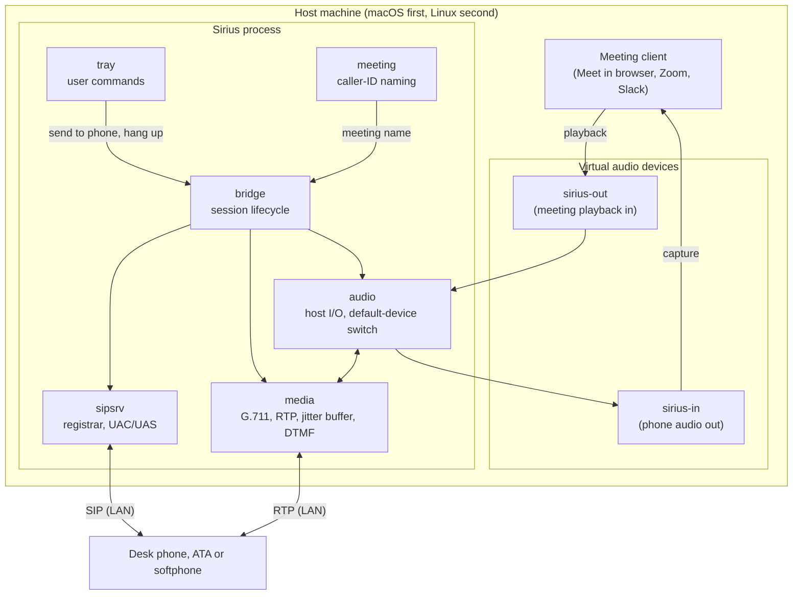

# Architecture overview

Status: draft. Last updated 2026-09-29.

## What Sirius does

You take part in a meeting from a physical desk phone, either a VoIP handset or an
analog phone behind an ATA, while the meeting itself keeps running in the browser or
desktop app on your computer.

## The constraint that shapes everything

Sirius never integrates with a meeting platform. No Slack app, no Meet or Zoom API,
no bot, no OAuth grant. The platforms only ever see a system microphone and a system
speaker, and everything runs locally.

That constraint is what lets Sirius work with any conferencing tool, including ones
that do not exist yet, without asking a vendor for permission. Anything built on a
platform API would have to be rebuilt for the next platform.

## System view

## How a session runs

1. The phone registers to Sirius' SIP registrar over the LAN. Sirius is the server,
   and the phone is a plain endpoint that needs no configuration beyond credentials.
2. You pick "send to phone" from the tray. `meeting` resolves a display name for the
   active meeting from local sources only, which in iteration 1 means window titles.
3. `bridge` switches the host's default input and output to the virtual devices, so
   the meeting client follows along without being reconfigured. It remembers the
   previous devices so it can put them back.
4. `sipsrv` sends an `INVITE` to the registered phone. The meeting name travels in
   the `From` display name, so caller ID already says which meeting is ringing.
5. On answer, `bridge` starts the audio path. Meeting playback is captured from
   `sirius-out`, resampled, encoded to G.711 and sent as RTP. The phone's RTP is
   decoded, resampled and played into `sirius-in`.
6. DTMF from the phone drives in-call control, currently mute and hang up. Hanging
   up tears the session down and restores the previous default devices.

## Decisions and why

Sirius is the SIP server rather than a client of some PBX, because it has to
originate the ring itself. Originating the call is also what makes caller ID
possible: the display name is ours to set.

There are two virtual devices instead of one, because a single loopback device would
feed Sirius' own output straight back into its input.

Sirius switches the host's default input and output. That is the only way to redirect
an arbitrary meeting client without integrating with it.

The first codec is G.711 (PCMU). It takes about thirty lines of pure Go, every phone
supports it, and it is the only realistic choice behind an analog ATA. G.722 wideband
comes later.

The trigger is explicit before it is calendar-driven, because iteration 1 exists to
prove the audio path, and that is where the engineering risk sits.

## Known risks

Clock drift and latency come first in difficulty. The host audio clock and the 20 ms
RTP cadence run independently, so without an adaptive jitter buffer, glitches
accumulate over minutes.

Echo matters only on speakerphone, and is harmless on a handset. The platform's own
AEC may cancel it, since its playout reference matches what the phone renders, but
the extra round trip may exceed its tail length. To be measured.

Microphone permission on macOS is a packaging problem. Capturing from a virtual
device counts as microphone access, so Sirius needs a signed `.app` bundle carrying
`NSMicrophoneUsageDescription`. An unsigned CLI binary inherits whatever grant the
terminal has and behaves unpredictably.

Host IP stability limits where this works. The phone needs Sirius' address and few
phones speak mDNS, so a DHCP reservation is required, and a VPN or a separate network
segment breaks the path. That follows from running only on the user's machine.

Clients that pin an audio device ignore the switch. Zoom in particular remembers an
explicit selection and has to be set to "same as system" once, by hand.

## Scope of iteration 1

In scope: send-to-phone from the tray, the SIP registrar, two-way G.711 audio, caller
ID from window titles, DTMF mute and hang up, macOS, and a softphone for testing.

Out of scope: calendar integration, G.722 and Opus, Linux, more than one phone,
recording, and calling a meeting from the phone rather than the other way round.
